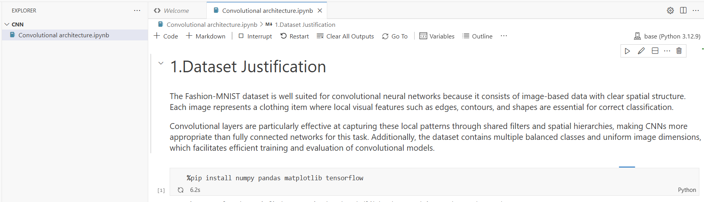

# Convolutional Neural Networks for Image Classification  
## Fashion-MNIST Case Study
Juan Sebastian Velandia

## Problem Description

The objective of this project is to study and compare neural network architectures for image classification.
A non-convolutional baseline model is implemented to establish a reference point for performance evaluation.
Subsequently, a convolutional neural network (CNN) is designed from scratch to leverage the spatial structure inherent in image data.

The project focuses on understanding why convolutional layers are effective and how architectural decisions impact model performance.

## Dataset Description

The Fashion-MNIST dataset consists of grayscale images of clothing items distributed across 10 classes.
It is a commonly used benchmark for image classification tasks.

- **Total samples:** 70,000 images  
- **Training set:** 60,000 images  
- **Test set:** 10,000 images  
- **Image resolution:** 28 × 28 pixels  
- **Channels:** 1 (grayscale)  
- **Classes:** 10

All images share the same dimensions, which eliminates the need for resizing.
Preprocessing includes normalization of pixel values and adding a channel dimension for convolutional models.

## Experimental Setup

Two models were evaluated:

1. A baseline neural network without convolutional layers.
2. A convolutional neural network designed specifically for image data.

Both models were trained using the same dataset, optimizer, and loss function to ensure a fair comparison.

## Experimental Results

### Baseline Model (Non-Convolutional)

- Training accuracy: approximately 88–90%
- Validation accuracy: approximately 85–87%
- Test accuracy: approximately 86–88%

While the baseline model achieves reasonable accuracy, it struggles to generalize effectively due to the loss of spatial information when flattening images.

### Convolutional Neural Network (CNN)

- Training accuracy: approximately 93–95%
- Validation accuracy: approximately 91–93%
- Test accuracy: approximately 91–93%

The CNN consistently outperforms the baseline model, demonstrating the benefits of convolutional layers for image classification tasks.

### Controlled Experiment: Kernel Size

A controlled experiment was conducted to evaluate the impact of convolutional kernel size while keeping all other factors constant.

- **3×3 kernels:** Higher accuracy and better generalization
- **5×5 kernels:** Slightly lower accuracy with increased computational cost

Smaller kernels proved more effective due to their ability to capture fine-grained local features while maintaining efficiency.

## Interpretation

Convolutional layers outperform fully connected layers because they preserve spatial relationships between pixels and exploit local correlations.
By sharing weights across spatial locations, CNNs reduce the number of parameters and improve generalization.

The inductive bias introduced by convolution assumes locality and translation invariance, which aligns well with the nature of image data.

However, convolutional architectures are not suitable for problems that lack spatial structure, such as tabular data or unordered feature representations.

## Conclusion

This study shows that convolutional neural networks provide a clear advantage over non-convolutional models for image classification.
Carefully designed CNN architectures can achieve strong performance while remaining computationally efficient and interpretable.

## Sagemaker

First we open Sagemaker studio

Then we open the code editor section

And we select create code space 

The next step is run the space and open the code editor

Now we create a new directory

And for last we copy the notebook and select run all, for chechk the correct running
